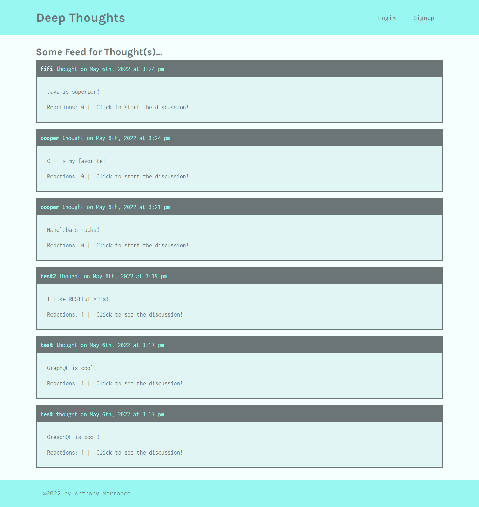

# Deep Thoughts

## Table of Contents
* [Description](#description)
* [Technologies Used](#technologies-used)
* [Installation](#installation)
* [Usage](#usage)
* [Contributing](#contributing)
* [Images](#images)
* [Deployed URL](#deployed-url)
* [Questions](#questions)

### Description
The application is a social media application called "Deep Thoughts," where users can create an account, post their thoughts for others to see, and interact with other users through these thoughts.  This is accomplished by using a MERN application. Feel free to contribute your own thoughts!

### Technologies Used
* MongoDB
* Express
* React
* Node.js
* JavaScript
* GraphQL

### Installation
1. Clone repository using `git clone git@github.com:ajmarrocco/deep-thoughts.git`
2. Type `npm i` or `npm install` to install all dependencies
3. Type `npm start` or `node server` to start database

### Usage 
All dependencies must be installed prior to using application

### Contributing 
Pull requests are reviewed

### Images

### Deployed URL
https://deep-thoughts-3510.herokuapp.com/

### Questions
If you have any questions about opening an issue or the repository itself, please contact me at ajmarrocco@gmail.com. Please visit https://github.com/ajmarrocco for more of my projects!